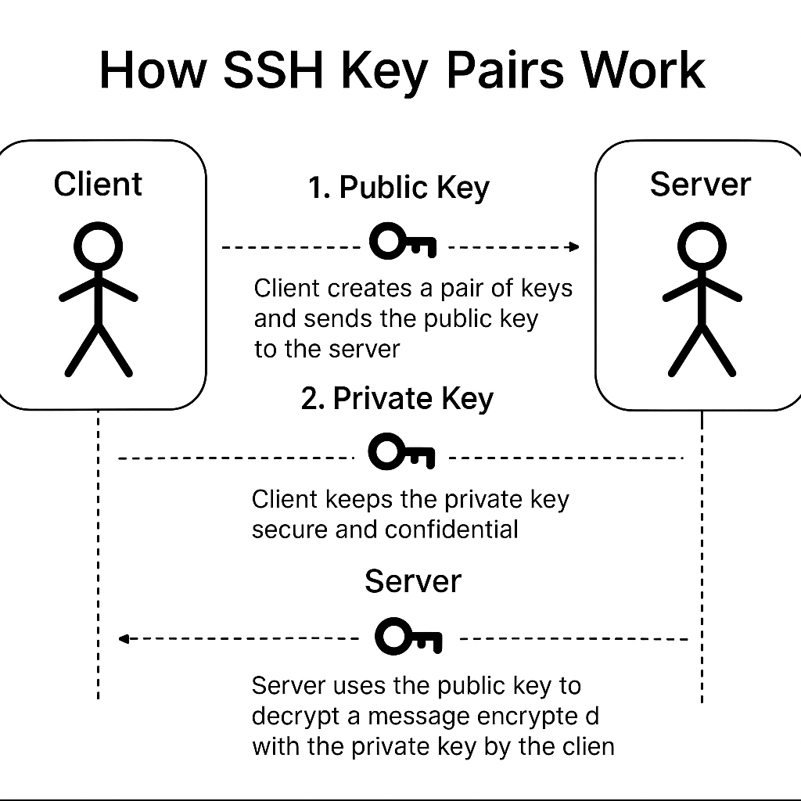
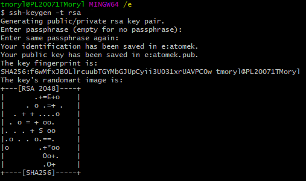

# SSH to GitHub

SSH (Secure Shell) is a secure method for authenticating with remote systems such as GitHub.  
Once configured, you can push and pull code from GitHub using your SSH keys instead of passwords.

---

# Table of Contents

- [What Are SSH Keys?](#what-are-ssh-keys)
- [Prerequisites](#prerequisites)
- [Generate SSH Keys](#generate-ssh-keys)
- [Locate and Verify Keys](#locate-and-verify-keys)
- [Register Public Key on GitHub](#register-public-key-on-github)
- [Start the SSH Agent](#start-the-ssh-agent)
- [Add Private Key to SSH Agent](#add-private-key-to-ssh-agent)
- [Test the SSH Connection](#test-the-ssh-connection)
- [Create a Test Git Repository](#create-a-test-git-repository)
- [Make SSH Keys Persist After Reboot](#make-ssh-keys-persist-after-reboot)
- [Create SSH Config File](#create-ssh-config-file)
- [Final Connection Test](#final-connection-test)
- [Optional Improvements](#optional-improvements)

---

## What Are SSH Keys?

SSH keys are a pair of cryptographic files:

- **Private key** (kept on your machine)
- **Public key** (uploaded to GitHub)

Your system proves identity using the **private key**, while GitHub verifies it using the **public key**.



---

## Prerequisites

- Git installed  
- Git Bash terminal  
- GitHub account  

---

## Generate SSH Keys

1. Open Git Bash and move into your SSH directory:

```bash
cd ~/.ssh
```

2. Generate a new key pair (RSA example):

```bash
ssh-keygen -t rsa -b 4096 -C "email@youremail.com"
```

3. Name your key files, e.g.:

```
craig-github-ssh-key
```

4. Press Enter through the prompts.



---

## Locate and Verify Keys

```bash
ls
```

List should include:

- `craig-github-ssh-key` (private)
- `craig-github-ssh-key.pub` (public)

Show the public key:

```bash
cat craig-github-ssh-key.pub
```


---

## Register Public Key on GitHub

Navigate to:

**Profile → Settings → SSH and GPG keys → New SSH key**

Add the public key and give it a descriptive title (match your file name if you like).


---

## Start the SSH Agent

```bash
eval $(ssh-agent -s)
```

---

## Add Private Key to SSH Agent

```bash
ssh-add craig-github-ssh-key
```

---

## Test the SSH Connection

```bash
cd ..
ssh -T git@github.com
```

You should see a success message such as:

```
Hi USERNAME! You've successfully authenticated...
```

---

## Create a Test Git Repository

```bash
mkdir test-ssh-repo
cd test-ssh-repo
echo "this is a test line" > testFile.txt
```

Add remote (SSH URL):

```bash
git remote add origin git@github.com:USERNAME/REPO.git
git add .
git commit -m "Add test file"
git push origin main
```

---

## Make SSH Keys Persist After Reboot

**Windows (PowerShell as Administrator):**

```powershell
Get-Service ssh-agent | Set-Service -StartupType Automatic
Start-Service ssh-agent
Get-Service ssh-agent
```

---

## Create SSH Config File

```bash
cd ~/.ssh
notepad config
```

Add:

```
Host github.com
    HostName github.com
    User git
    IdentityFile ~/.ssh/craig-github-ssh-key
    IdentitiesOnly yes
    AddKeysToAgent yes
```

Set permissions (Git Bash):

```bash
chmod 600 config
```

Add key to agent (one-time):

```bash
ssh-add ~/.ssh/craig-github-ssh-key
ssh-add -l
```

---

## Final Connection Test

```bash
ssh -T git@github.com
```

---

## Optional Improvements

**Use Ed25519 (recommended):**

```bash
ssh-keygen -t ed25519 -C "email@youremail.com"
```

---